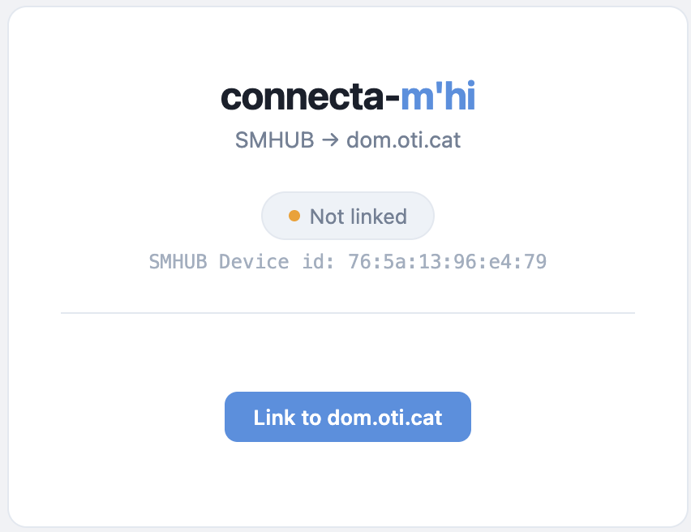
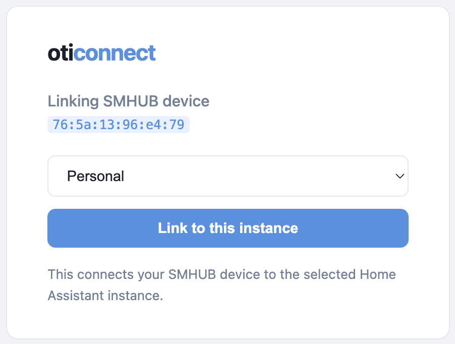
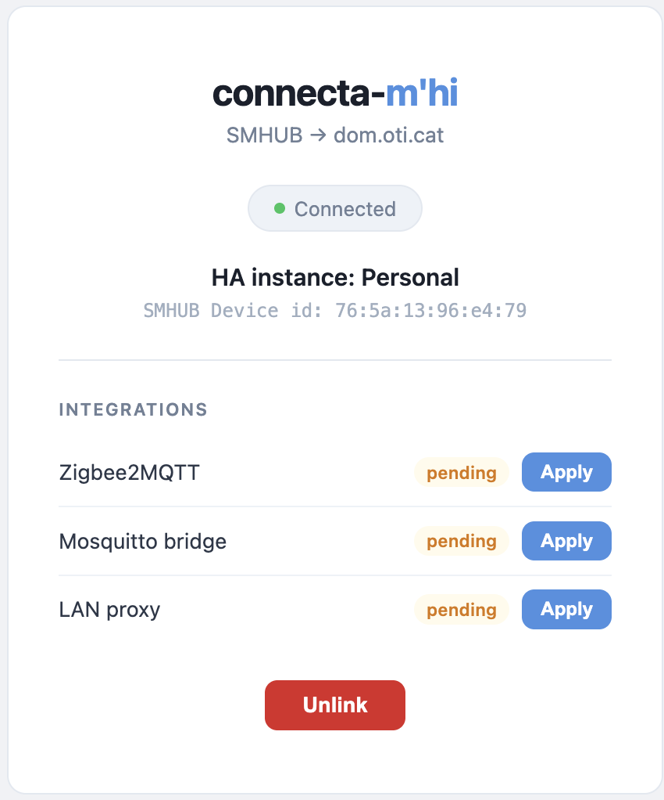
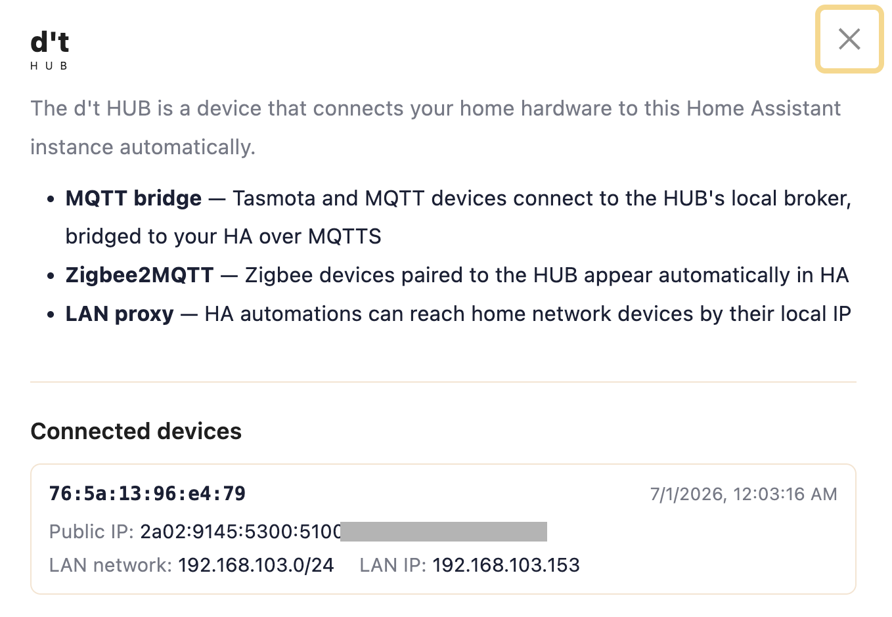
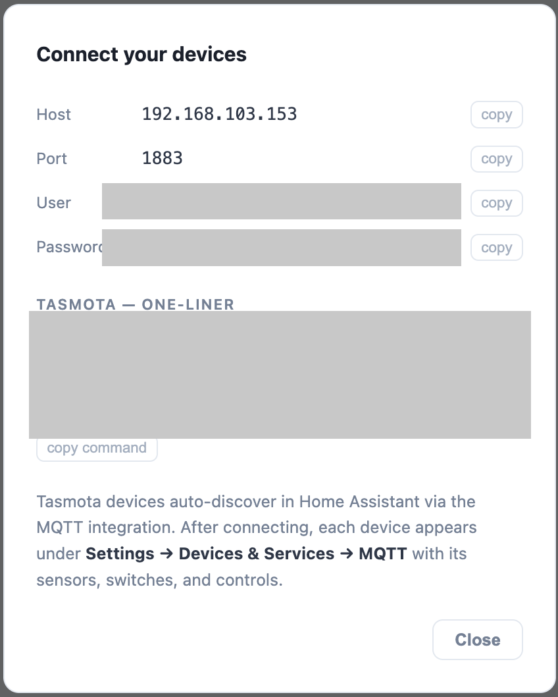
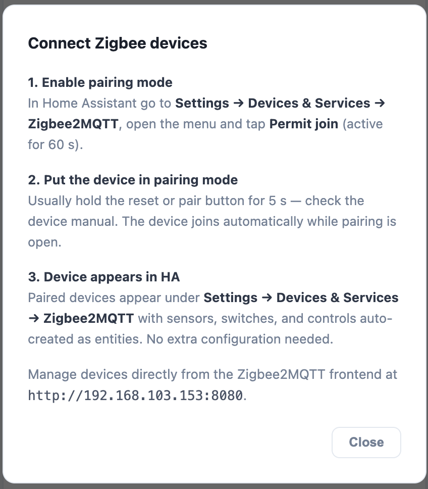

# connecta-m'hi

**connecta-m'hi** is an IPK package for the [SMHUB Nano MG24](https://smlight.tech/product/smhub-nano-mg24/) that connects the device to a [Home Assistant](https://www.home-assistant.io/) instance managed by [dom.oti.cat](https://dom.oti.cat).

Once installed, the app appears in the SMHUB sidebar. With a single click you link your SMHUB to your dom.oti.cat Home Assistant instance and then selectively enable three integrations:

| Integration | What it does |
|---|---|
| **Mosquitto bridge** | Extends the SMHUB's local MQTT broker to your HA instance over TLS. Point any Tasmota device at the SMHUB and it auto-discovers in HA. |
| **Zigbee2MQTT** | Connects the built-in Zigbee radio directly to your HA instance via MQTTS. Zigbee devices paired on the SMHUB appear in HA automatically. |
| **LAN proxy** | Bridges your home network to HA. HA can reach any device on your home LAN by IP (currently only TCP), and your HA instance is reachable from home at `http://smhub.local:8123`. |

---

## Requirements

- **SMHUB Nano MG24** running SMHUB OS 1.0.0 beta4 or later
- A **dom.oti.cat account** with at least one active Home Assistant instance

---

## Installation

The package will be available at `pkg.smlight.tech` once reviewed. Until then, install manually via SSH.

### Step 1 — Download the IPK

Download the latest `.ipk` file from the [Releases](../../releases/latest) page.

### Step 2 — Copy to SMHUB

```bash
scp dom.oti.cat_<version>-1_all.ipk smlight@smhub.local:/tmp/
```

### Step 3 — Install

```bash
ssh smlight@smhub.local "sudo opkg install /tmp/dom.oti.cat_<version>-1_all.ipk"
```

To upgrade from a previous version:

```bash
ssh smlight@smhub.local "sudo opkg remove dom.oti.cat; sudo opkg install /tmp/dom.oti.cat_<version>-1_all.ipk"
```

After installation, **connecta-m'hi** appears in the SMHUB sidebar.


---

## Linking to dom.oti.cat

Open the **connecta-m'hi** app from the SMHUB sidebar. Before linking, it shows the device ID and a button to start the process.



Click **Link to dom.oti.cat**. A new browser tab opens on the dom.oti.cat website where you can select which of your Home Assistant instances to link to this SMHUB.



Once you confirm the selection, the tab shows a success message and the app card refreshes automatically — no page reload needed.



The status badge turns green when the WebSocket connection to your HA instance is established.

You can verify the same connection from the cloud side: open the **d't HUB** modal on your Home Assistant instance's page at dom.oti.cat, under **Connected devices**. Each linked SMHUB is listed by its device ID (MAC address), along with its public IP, and — if the LAN proxy integration is enabled — the home network's subnet and the SMHUB's local IP on that network.



---

## Integrations

### Mosquitto bridge — Tasmota devices

Click **Apply** next to *Mosquitto bridge*. The app will:

1. Open a password-protected MQTT listener on port **1883** (accessible from your home network)
2. Bridge `tele/#`, `stat/#`, `cmnd/#` and `tasmota/#` topics to your HA instance over MQTTS (port 8883, TLS)
3. Restart the Mosquitto broker

After applying, click **Device setup** to get the connection details and a ready-to-paste Tasmota one-liner.



Point any Tasmota device at the SMHUB using the displayed credentials. Each device auto-discovers in Home Assistant under **Settings → Devices & Services → Tasmota**.

---

### Zigbee2MQTT — Zigbee devices

Click **Apply** next to *Zigbee2MQTT*. The app writes the MQTT connection block directly into Zigbee2MQTT's `configuration.yaml` (server, credentials, client ID, TLS CA) and enables Home Assistant discovery, then restarts Zigbee2MQTT.

After applying, click **Device setup** for the pairing guide.



Paired Zigbee devices appear in Home Assistant under **Settings → Devices & Services → MQTT** with all sensors, switches, and controls created automatically.

You can also manage Zigbee devices from the Zigbee2MQTT frontend at `http://smhub.local:8080`.

---

### LAN proxy — reach home devices from HA

Click **Apply** next to *LAN proxy*. This enables two things at once:

- **HA accessible at home** — your HA instance is reachable at `http://smhub.local:8123` from any browser on your home network. Use this as the *Local server URL* in the Home Assistant companion app.
- **HA can reach LAN devices** — HA can connect to any device on your home network by its local IP. Just enter the device's IP directly when configuring any integration — no proxy settings needed. Useful for integrations like ESPHome, local cameras, or other local APIs. Currently only TCP connections are supported.

---

## Unlink

Each integration has its own **Unlink** button that reverts only that integration. The **Unlink** button at the bottom of the card removes all applied integrations and disconnects the SMHUB from dom.oti.cat entirely.

---

## How it works (architecture overview)

```
SMHUB Nano MG24              oti.cat cloud              Your HA instance
┌─────────────────┐          ┌──────────────┐           ┌─────────────────┐
│  connecta-m'hi  │◄─MQTTS──►│  Layer7 LB   │◄─plain───►│  Mosquitto      │
│  (this package) │          │  SNI routing │           │                 │
│                 │          └──────────────┘           │                 │
│  Mosquitto      │                                     │                 │
│  (bridge mode)  │◄──WebSocket (wss)───────────────────│  connecta-m'hi  │
│                 │                                     │  sidecar        │
│  Zigbee2MQTT    │──MQTTS direct──────────────────────►│                 │
└─────────────────┘                                     └─────────────────┘
```

The SMHUB-side app (this package) communicates with a sidecar service running on your HA instance via a persistent WebSocket. The LAN proxy and SOCKS5 tunnel for transparent LAN routing are both multiplexed over this same WebSocket connection — no extra ports needed on the cloud side.

---

## Building from source

Requires `bash`, `tar`, and `binutils` (for `ar`).

```bash
git clone https://github.com/oticat/connecta-m-hi.git
cd connecta-m-hi
bash build.sh
# → out/dom.oti.cat_1.7.7-1_all.ipk
```

To build a specific version:

```bash
VERSION=1.8.0 bash build.sh
```

---

## Releasing

1. Update `Version:` in `control/control` (e.g. `Version: 1.8.0-1`)
2. Commit and push
3. Go to **Actions → Release IPK → Run workflow**

The workflow reads the version from `control/control`, builds the IPK, creates the git tag, and publishes a GitHub Release with the IPK attached. It will fail if the tag already exists.

---

## License

Apache License 2.0 — see [LICENSE](LICENSE).

Copyright 2026 [dom.oti.cat](https://dom.oti.cat)
